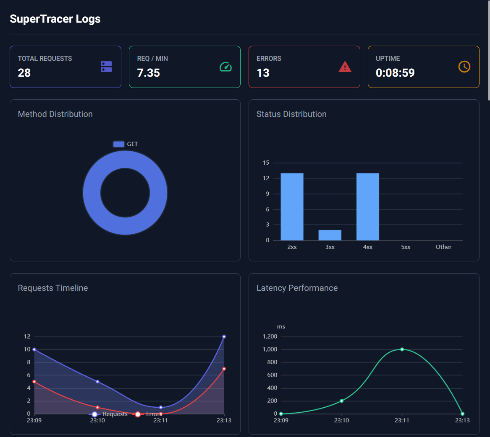
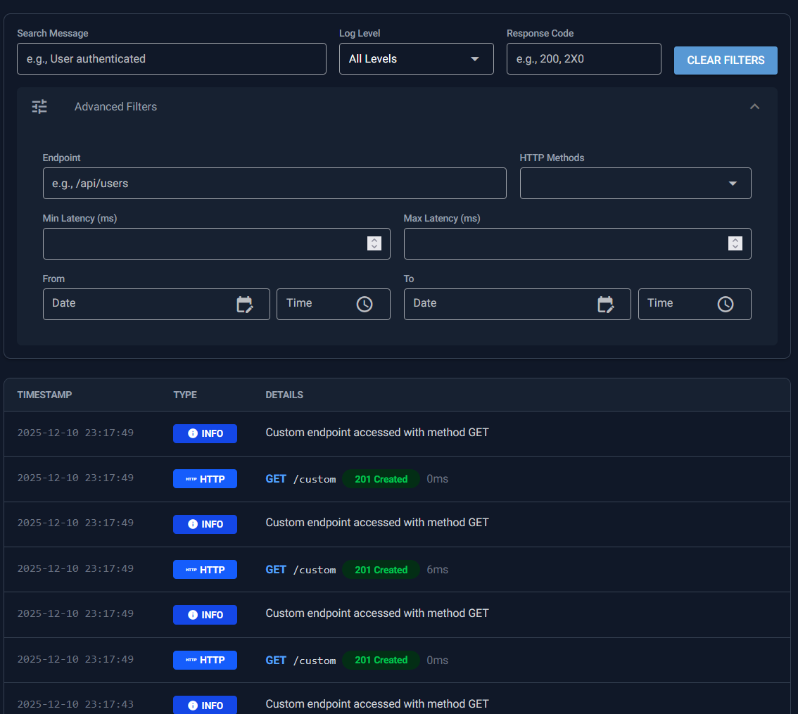
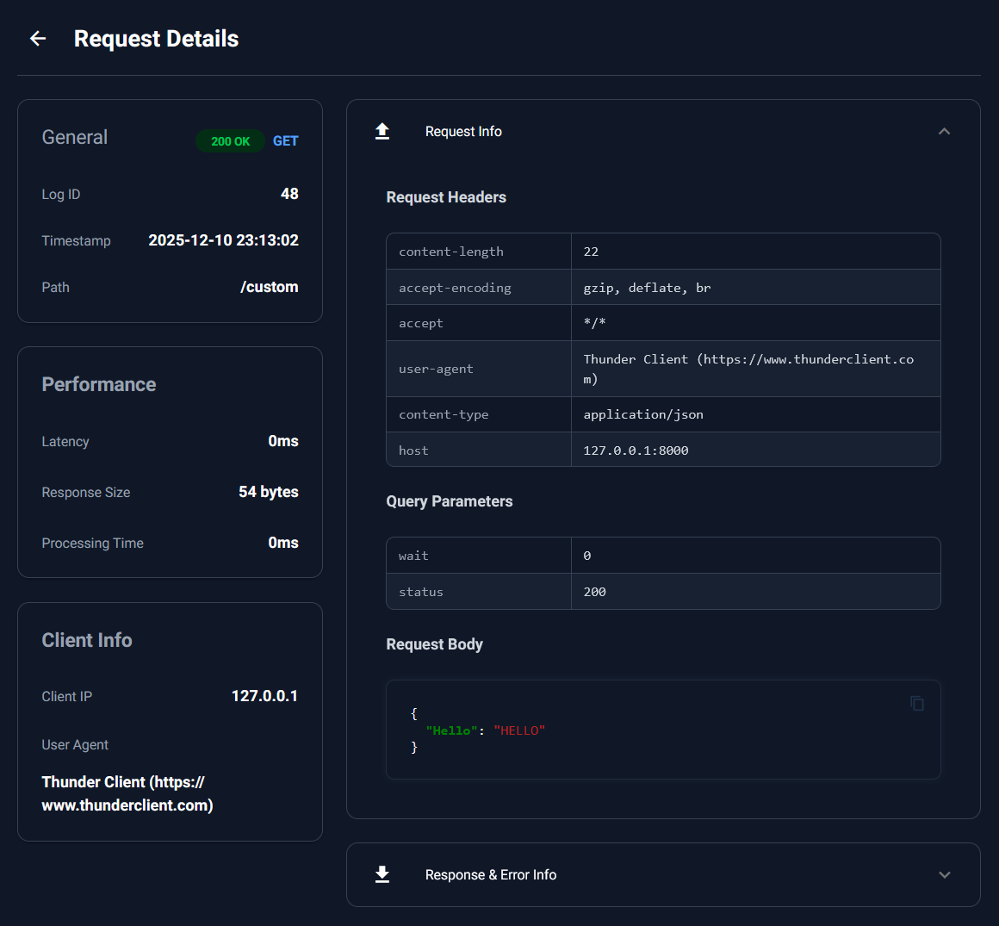

# SuperTracer

SuperTracer is a powerful and easy-to-use logging and tracing library for FastAPI applications. It provides a real-time dashboard to monitor requests, analyze performance, and debug issues with ease.



## Features

- **Real-time Dashboard**: Monitor incoming requests and logs as they happen.
- **Comprehensive Logging**: Captures request/response bodies, headers, status codes, latency, and more.
- **Multiple Storage Backends**: Support for In-Memory, SQLite, and PostgreSQL.
- **Advanced Filtering**: Filter logs by method, status code, latency, date, and content.
- **Metrics & Analytics**: Visualize request rates, error rates, and latency distributions.
- **Secure**: Built-in authentication for the dashboard and API.
- **Easy Configuration**: Configure via JSON file or Python objects.

## Installation

```bash
pip install supertracer
```

## Quick Start

Integrate SuperTracer into your FastAPI application in just a few lines of code:

```python
from fastapi import FastAPI
from supertracer import SuperTracer

app = FastAPI()

# Initialize SuperTracer (defaults to In-Memory storage)
tracer = SuperTracer(app)

@app.get("/")
def read_root():
    return {"Hello": "World"}
```

Now run your application and visit `/supertracer/logs` to see the dashboard!

## Storage Backends

SuperTracer supports different storage backends. By default, it uses an in-memory connector. To use a persistent database, pass the connector instance:

### SQLite

```python
from supertracer import SuperTracer, SQLiteConnector

# ... app setup ...

connector = SQLiteConnector("requests.db")
tracer = SuperTracer(app, connector=connector)
```

### PostgreSQL

```python
from supertracer import SuperTracer, PostgreSQLConnector

# ... app setup ...

connector = PostgreSQLConnector(
    host="localhost",
    port=5432,
    database="supertracer_db",
    user="your_username",
    password="your_password"
    sslmode="prefer"
)
tracer = SuperTracer(app, connector=connector)
```

## Configuration

SuperTracer is highly configurable. You can use a `supertracer.config.json` file in your project root or pass options programmatically.

### Using `supertracer.config.json`

Create a file named `supertracer.config.json` to configure logging, metrics, auth, and more:

```json
{
  "logger_options": {
    "level": 20,
    "format": "%(message)s"
  },
  "metrics_options": {
    "enabled": true,
    "history_limit": 1000
  },
  "capture_options": {
    "capture_request_body": true,
    "max_request_body_size": 10240,
    "capture_response_body": true
  }
}
```

### Programmatic Configuration

You can also pass options directly:

```python
from supertracer import SuperTracer, SupertracerOptions, LoggerOptions

options = SupertracerOptions(
    logger_options=LoggerOptions(level=10), # DEBUG
)

tracer = SuperTracer(app, options=options)
```

## UI Overview

### Dashboard


### Logs View


### Request Details


## Documentation

For detailed documentation on all available options, connectors, and advanced usage, please refer to the [docs](docs/) folder.

## License

MIT
